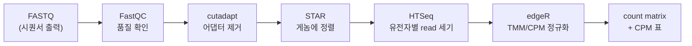

# BulkRNAseq_Pipeline

**시퀀싱 결과 파일(FASTQ)을 받아서, 유전자별 발현량 표를 만들어주는 파이프라인입니다.**

DEG 분석이나 GO enrichment 같은 "해석" 단계는 여기 없습니다. 그 앞의 **전처리 전부**를 담당합니다.
전처리는 어느 프로젝트든 하는 일이 똑같기 때문에, 매번 새로 짜지 말고 이 저장소 하나만 쓰자는 게
이 파이프라인의 목적입니다.



---

## 목차

1. [시작하기 전에 — 각 단계가 무엇을 하는지](#1-시작하기-전에--각-단계가-무엇을-하는지)
2. [설치](#2-설치)
3. [데이터 넣기](#3-데이터-넣기)
4. [group.conf 작성](#4-groupconf-작성)
5. [1단계 실행](#5-1단계-실행)
6. [strandedness 판정 — 사람이 하는 유일한 판단](#6-strandedness-판정--사람이-하는-유일한-판단)
7. [2단계 실행](#7-2단계-실행)
8. [결과 읽기](#8-결과-읽기)
9. [자주 만나는 오류](#9-자주-만나는-오류)
10. [설계 규칙](#10-설계-규칙)

---

## 1. 시작하기 전에 — 각 단계가 무엇을 하는지

처음이라면 이 표만 이해하고 넘어가도 충분합니다. 실행은 명령어 두 줄이고, 아래는 그 두 줄
안에서 무슨 일이 일어나는지에 대한 설명입니다.

| 단계 | 도구 | 하는 일 | 왜 필요한가 |
|---|---|---|---|
| 품질 확인 | FastQC | read 길이·품질점수·GC 비율 등을 그림으로 요약 | 시퀀싱이 망한 샘플을 **분석 전에** 걸러내기 위해. 나중에 발견하면 며칠을 버린다 |
| 어댑터 제거 | cutadapt | read 끝에 붙은 인공 서열(adapter)을 잘라냄 | 어댑터는 게놈에 없는 서열이라, 남겨두면 정렬이 실패하거나 엉뚱한 위치에 붙는다 |
| 정렬 | STAR | 각 read 가 게놈의 어느 위치에서 왔는지 찾음 | RNA-seq read 는 intron 이 잘려나간 상태라, 두 exon 에 걸쳐 붙을 수 있어야 한다 (splice-aware aligner) |
| 세기 | HTSeq | 각 유전자 영역에 몇 개의 read 가 떨어졌는지 셈 | 이 숫자가 곧 "발현량"의 원자료다 |
| 정규화 | edgeR (TMM→CPM) | 샘플마다 다른 총 read 수를 보정 | 샘플 A 가 5천만 read, B 가 2천만 read 면 raw count 를 직접 비교할 수 없다 |

**용어 두 개만 미리:**

- **read** — 시퀀서가 읽어낸 짧은 염기서열 조각 (보통 50~150 bp). FASTQ 파일 안에 수천만 개 들어 있다.
- **paired-end** — 한 조각(fragment)의 양쪽 끝을 각각 읽은 것. 파일이 `_1`, `_2` 두 개로 온다.
  한쪽만 읽었으면 **single-end** 이고 파일이 하나다. 파이프라인이 자동으로 구분한다.

---

## 2. 설치

### 2-1. 저장소 받기

홈 디렉토리에 받습니다. 참조 게놈·중간물·결과가 전부 이 폴더 안에 쌓이므로,
**용량 여유가 있는 곳**(수 TB)에 두어야 합니다.

```bash
cd ~
git clone https://github.com/YuHwanYuHwan/BulkRNAseq_Pipeline.git
cd BulkRNAseq_Pipeline
```

```
~/BulkRNAseq_Pipeline/
  rawData/            원본 FASTQ (직접 넣거나 다운로드)
  reference_Genomes/  게놈 FASTA·GTF·STAR 인덱스
  Processed/          중간물 (trimmed FASTQ, BAM) — 지워도 됨
  Output/             최종 결과 (count matrix, CPM, 리포트)
  Scripts/            파이프라인 코드
```

### 2-2. 소프트웨어 설치

conda 환경 하나에 필요한 도구를 전부 담습니다.

```bash
bash setup.sh --create-env
```

이 명령은 `rnaseq-preproc` 라는 conda 환경을 만들고, 아래 도구들을 설치합니다.

| 도구 | 용도 |
|---|---|
| `sra-tools` | 공공 데이터베이스(NCBI SRA)에서 FASTQ 다운로드 |
| `FastQC` | read 품질 확인 |
| `cutadapt` | 어댑터 제거 |
| `STAR` | 게놈 정렬 + 인덱스 생성 |
| `HTSeq` | 유전자별 count |
| `MultiQC` | 여러 QC 결과를 리포트 하나로 합침 |
| `R` + `edgeR` | TMM/CPM 정규화 |

직접 만들고 싶다면:

```bash
conda create -n rnaseq-preproc -c conda-forge -c bioconda \
    sra-tools fastqc cutadapt star htseq multiqc bioconductor-edger
conda activate rnaseq-preproc
```

> 채널 순서가 중요합니다. `conda-forge` 를 `bioconda` 보다 **앞에** 써야 의존성이 꼬이지 않습니다.

### 2-3. 참조 게놈 준비

read 를 어디에 붙일지 알려면 **게놈 서열(FASTA)** 과 **유전자 위치 정보(GTF)** 가 필요합니다.
용량이 크고(수 GB) 사람마다 원하는 버전이 달라서, 이건 직접 받습니다.

[Ensembl FTP](https://ftp.ensembl.org/pub/) 에서 받아, **저장소 안의** `reference_Genomes/` 에
아래 구조로 둡니다. 경로를 따로 설정할 수 없고 여기 고정입니다.

```
reference_Genomes/
  Homo_sapiens/
    Homo_sapiens.GRCh38.dna.primary_assembly.fa
    Homo_sapiens.GRCh38.113.gtf
  Mus_musculus/
    Mus_musculus.GRCm39.dna.primary_assembly.fa
    Mus_musculus.GRCm39.115.gtf
```

```bash
# 예: 사람 게놈, Ensembl release 113
mkdir -p reference_Genomes/Homo_sapiens && cd reference_Genomes/Homo_sapiens
wget https://ftp.ensembl.org/pub/release-113/fasta/homo_sapiens/dna/Homo_sapiens.GRCh38.dna.primary_assembly.fa.gz
wget https://ftp.ensembl.org/pub/release-113/gtf/homo_sapiens/Homo_sapiens.GRCh38.113.gtf.gz
gunzip *.gz
cd ../..
```

> **폴더 이름은 반드시 학명**(`Homo_sapiens`, `Mus_musculus`)으로. 스크립트가 이 이름으로 파일을 찾습니다.

**STAR 인덱스는 받지 않습니다.** 인덱스는 게놈을 STAR 가 빠르게 검색할 수 있게 미리 가공해둔
자료구조인데, 데이터의 read 길이에 맞춰 만들어야 해서 파이프라인이 **필요할 때 자동으로 만듭니다.**
한 번 만들면 영구 보존되어 다음 데이터부터는 재사용됩니다.
(인덱스 하나에 디스크 약 30 GB, 생성에 RAM 32 GB 이상 필요)

### 2-4. 설치 확인

```bash
bash setup.sh
```

`--create-env` 없이 실행하면 **아무것도 설치하지 않고 상태만 보고**합니다. 몇 번을 돌려도 안전합니다.

```
== config ==
  [ OK ] config.sh
== tools ==
  [ OK ] prefetch
  [ OK ] STAR
  ...
== reference genomes ==
  [ OK ] Homo_sapiens  (Homo_sapiens.GRCh38.113.gtf)
== disk ==
  [ OK ] 75826G free
== self-check ==
  [ OK ] logic 6/6

Ready. Next: put FASTQ under rawData/<project>/<group>/ and write group.conf (species).
```

`[MISS]` 가 하나라도 있으면 그것부터 해결하세요. **6시간짜리 STAR 가 3단계에서 죽고 나서
참조 게놈이 없었다는 걸 알게 되는 상황을 막는 것**이 이 스크립트의 존재 이유입니다.

`[ OK ] logic 6/6` 은 파이프라인 내부 로직 자체를 검사한 결과입니다. 생물정보 도구가 하나도
설치되지 않은 상태에서도 돌기 때문에, clone 직후 코드가 멀쩡한지 먼저 확인할 수 있습니다.

<details>
<summary>도구가 PATH 에 없을 때 (config.sh)</summary>

`setup.sh` 가 `config.sh` 를 만들어줍니다. `CONDA_ENV` 만 채워진 상태로 시작하고,
나머지는 필요할 때 주석을 풉니다.

```bash
# 도구가 들어 있는 conda 환경. 모든 스크립트가 이걸 자동으로 activate 합니다
CONDA_ENV="rnaseq-preproc"

# conda 대신 직접 받은 FastQC 를 쓴다면
FASTQC_BIN="/home/user/FastQC/fastqc"
```

이미 다른 방식으로 도구를 설치했다면 `CONDA_ENV=""` 로 비우면 됩니다.

`config.sh` 는 기계마다 다르므로 git 에 올라가지 않습니다(`.gitignore`).
</details>

---

## 3. 데이터 넣기

### 폴더 구조부터 이해하기

```
rawData/<project>/<group>/
```

- **project** — 연구 단위. 예: `Musculoskeletal_Map`
- **group** — **count matrix 를 하나 뽑는 단위.** 예: `Sarcopenia`, `Cachexia`

group 을 나누는 기준은 "이 샘플들끼리 비교할 것인가"입니다. 대조군과 실험군은 같은 group 에
들어가야 하고, 전혀 다른 질환·다른 실험은 group 을 나눕니다. **정규화가 group 단위로 일어나기**
때문입니다 — 관계없는 샘플을 섞으면 정규화가 왜곡됩니다.

### 방법 A. 공공 데이터 (GEO/SRA)

SRR 번호만 있으면 됩니다.

```bash
bash Scripts/PublicData_download.sh rawData/MyProject/MyGroup SRR27743399 SRR27743400
```

번호가 많으면 파일로 줘도 됩니다.

```bash
bash Scripts/PublicData_download.sh rawData/MyProject/MyGroup srr_list.txt
```

이 스크립트는 세 가지를 합니다.

1. NCBI 에서 **메타데이터**(`metadata.csv`)를 받아옵니다 — read 길이, layout, 샘플명 등
2. FASTQ 를 받아 압축합니다
3. **한 샘플이 여러 run 으로 쪼개져 있으면 자동으로 하위 폴더로 묶습니다**

3번이 중요합니다. GEO 의 한 샘플(GSM)이 SRA 에서는 여러 run(SRR)으로 나뉘어 있는 경우가 흔한데,
이걸 모르고 각각을 별개 샘플로 처리하면 **샘플 수가 뻥튀기되고 발현량이 반토막 납니다.**
스크립트가 `SampleName` 을 보고 같은 샘플이면 한 폴더에 넣어, 이후 단계에서 자동으로 합쳐집니다.

### 방법 B. 직접 생산한 데이터

FASTQ 를 group 폴더에 그냥 넣으면 됩니다. **파일 이름이 곧 샘플 이름**입니다.

```
rawData/MyProject/MyGroup/
    siControl-1_1.fastq.gz     ← 샘플 이름: siControl-1 (paired-end)
    siControl-1_2.fastq.gz
    siLSP1-1_1.fastq.gz        ← 샘플 이름: siLSP1-1
    siLSP1-1_2.fastq.gz
    SRR009.fastq.gz            ← 샘플 이름: SRR009 (single-end)
    GSM7712347/                ← 폴더 이름이 샘플 이름. 안의 run 들은 합쳐진다
        SRR27743401_1.fastq.gz
        SRR27743401_2.fastq.gz
        SRR27743402_1.fastq.gz
        SRR27743402_2.fastq.gz
```

규칙은 세 개뿐입니다.

| 배치 | 해석 |
|---|---|
| 평면 파일 `X_1.fastq.gz` + `X_2.fastq.gz` | 샘플 `X`, paired-end |
| 평면 파일 `X.fastq.gz` | 샘플 `X`, single-end |
| 폴더 `X/` | 샘플 `X`, 안의 모든 run 을 합쳐서 처리 |

**샘플 목록을 적는 시트는 없습니다.** 디렉토리 구조가 유일한 진실원입니다. 시트를 따로 두면
파일과 시트가 어긋나는 순간 조용히 틀린 결과가 나오기 때문입니다.

확인해보고 싶으면:

```bash
source Scripts/lib/common.sh
GROUP_DIR=$(pwd)/rawData/MyProject/MyGroup
list_samples
```

`샘플이름 <TAB> R1 <TAB> R2` 형식으로 출력됩니다. 여기 보이는 대로 처리됩니다.

---

## 4. group.conf 작성

**사람이 손으로 쓰는 파일은 이것 하나뿐입니다.** group 폴더 안에 만듭니다.

```bash
cat > rawData/MyProject/MyGroup/group.conf <<'EOF'
species      = Homo_sapiens
adapter_kit  = Illumina_TruSeq
strandedness =
EOF
```

| 항목 | 필수 | 설명 |
|---|---|---|
| `species` | ✅ | `reference_Genomes/` 아래 폴더명과 정확히 일치해야 함 |
| `adapter_kit` | ❌ | 라이브러리 제작 kit. 생략하면 `Illumina_universal`. 목록은 `Scripts/AdapterSequenceList.csv` |
| `strandedness` | ⚠️ | **처음엔 비워둡니다.** 1단계 후 직접 확인해서 채웁니다 (6장) |

`=` 양옆 공백, 따옴표, `#` 주석 전부 허용됩니다.

<details>
<summary>왜 read 길이나 paired/single 은 안 적나요?</summary>

**데이터에서 알아낼 수 있는 값은 사람에게 묻지 않는다**는 게 이 파이프라인의 원칙입니다.
read 길이는 FASTQ 를 읽으면 나오고, paired 여부는 파일 개수로 알 수 있습니다.
사람이 적는 값이 늘어날수록 오타로 결과가 틀어질 여지가 늘어납니다.

반대로 `strandedness` 는 **데이터를 실제로 세어보기 전에는 알 수 없어서** 사람이 적습니다.
</details>

---

## 5. 1단계 실행

```bash
bash Scripts/run_stage1.sh rawData/MyProject/MyGroup
```

FastQC → cutadapt → STAR → strandedness probe 를 순서대로 돌립니다.

**시간이 오래 걸립니다.** 샘플 수와 시퀀싱 깊이에 따라 다르지만 STAR 단계만 샘플당 20분~1시간,
게다가 첫 실행이면 STAR 인덱스 생성(1~2시간)이 앞에 붙습니다. 접속이 끊겨도 계속 돌게 하려면:

```bash
mkdir -p logs
nohup bash Scripts/run_stage1.sh rawData/MyProject/MyGroup > logs/stage1.log 2>&1 &
tail -f logs/stage1.log      # Ctrl+C 로 보기만 중단 (작업은 계속 돌아감)
```

SLURM 클러스터라면 그대로 `sbatch` 로 던져도 됩니다. 스크립트 안에 `#SBATCH` 설정이 들어 있습니다.

```bash
sbatch Scripts/run_stage1.sh rawData/MyProject/MyGroup
```

> **중간에 죽어도 괜찮습니다.** 끝난 샘플은 `.done` 표시가 남아서, 다시 실행하면 `[SKIP]` 하고
> 중단된 지점부터 이어갑니다. 단순히 같은 명령을 다시 치면 됩니다.

<details>
<summary>단계별로 하나씩 돌리고 싶다면</summary>

모든 스크립트가 **group 폴더 하나만** 인자로 받습니다.

```bash
bash Scripts/FastQC.sh            rawData/MyProject/MyGroup
bash Scripts/Trimming.sh          rawData/MyProject/MyGroup
bash Scripts/Alignment.sh         rawData/MyProject/MyGroup
bash Scripts/probe_strandedness.sh rawData/MyProject/MyGroup
```
</details>

---

## 6. strandedness 판정 — 사람이 하는 유일한 판단

### 무엇을 정하는 건가

라이브러리 제작 방식에 따라, **read 가 원래 RNA 의 어느 가닥에서 왔는지 정보가 보존되는 경우와
아닌 경우**가 있습니다. 이게 `strandedness` 입니다.

| 값 | 의미 |
|---|---|
| `no` | 가닥 정보 없음 (unstranded). 어느 가닥이든 그냥 센다 |
| `reverse` | 가닥 정보 있음. read 가 유전자와 **반대** 방향 (요즘 대부분의 kit) |
| `yes` | 가닥 정보 있음. read 가 유전자와 **같은** 방향 |

**이걸 틀리면 에러가 나지 않습니다.** 대신 read 가 유전자에 배정되지 않고 조용히 버려져서,
발현량이 통째로 줄어든 표가 나옵니다. 그래서 반드시 확인하고 넘어갑니다.

### 왜 자동으로 정하지 않나

kit 이름으로는 예측할 수 없기 때문입니다. 실제로 `SureSelect Strand Specific` 이라는 이름을
달고도 unstranded 인 데이터가 존재합니다. 이름을 믿고 자동 판정하면 그 순간 결과가 틀립니다.

### 판정 방법

1단계 마지막의 `probe_strandedness.sh` 가 **샘플 하나만** `-s reverse` 로 세어보고 결과를 보여줍니다.

```
[PROBE] sample=GSM7712347  -s reverse

  total reads counted : 42817203
  assigned to genes   : 36129844 (84.4%)
  __no_feature        : 5891203 (13.8%)
  __ambiguous         : 796156

  --> likely strandedness : reverse   (most reads assigned)
```

`__no_feature` 는 **어떤 유전자에도 배정되지 못한 read 의 비율**입니다. 한 번만 돌려도 세 경우가
전부 갈립니다.

| `-s reverse` 로 돌렸을 때 `__no_feature` | 결론 | 왜 |
|---|---|---|
| 낮음 (~10-20%) | **`reverse`** | 제대로 배정됐다. 가정이 맞았다 |
| 중간 (~50%) | **`no`** | 절반이 반대 가닥에 있다 = 가닥 정보가 없는 데이터 |
| 높음 (80%+) | **`yes`** | 거의 배정이 안 됐다 = 방향을 반대로 가정했다 |

결과를 보고 `group.conf` 에 적습니다.

```bash
sed -i 's/^strandedness.*/strandedness = reverse/' rawData/MyProject/MyGroup/group.conf
```

> 위 임계값은 경험칙입니다. 애매한 값(예: 35%)이 나오면 다른 샘플로도 한 번 더 돌려보세요.
> **판단은 사람 몫입니다.**

---

## 7. 2단계 실행

```bash
bash Scripts/run_stage2.sh rawData/MyProject/MyGroup
```

HTSeq → count matrix → CPM → MultiQC + 리포트.

`strandedness` 가 비어 있으면 **시작하자마자 거부합니다.** 잘못된 값으로 몇 시간을 태우는 것보다
낫기 때문입니다.

```
[ERROR] group.conf strandedness must be no|yes|reverse (got 'empty')
        run: bash Scripts/probe_strandedness.sh rawData/MyProject/MyGroup
```

---

## 8. 결과 읽기

```
Output/<project>/<group>/
    <group>_count_matrix.tsv      유전자 × 샘플 raw count
    <group>_CPM.tsv               TMM 정규화된 CPM
    <group>_multiqc_report.html   전 단계 QC 요약 (브라우저로 열기)
    <group>_pipeline_report.txt   버전·파라미터·QC + 논문 Methods 초안
```

**`count_matrix.tsv`** 가 다음 분석(DEG 등)의 입력입니다.

```
Gene            siControl-1  siControl-2  siLSP1-1  siLSP1-2
ENSMUSG00000000001    1284         1301       997      1043
ENSMUSG00000000003       0            0         0         0
```

**`pipeline_report.txt`** 는 나중에 논문을 쓸 때를 위한 파일입니다. 사용한 도구 버전, 파라미터,
게놈 버전이 전부 적혀 있고 Methods 초안 문단까지 들어 있습니다. 분석하고 1년 뒤에 "STAR 몇 버전
썼더라" 를 찾아 헤매지 않기 위한 장치입니다.

<details>
<summary>MultiQC 리포트에서 볼 것</summary>

- **FastQC — Per base sequence quality**: 뒤쪽에서 품질이 급락하면 trimming 을 더 해야 할 수 있음
- **cutadapt — Filtered Reads**: 너무 많이 잘려나갔다면 kit 을 잘못 지정했을 가능성
- **STAR — Alignment Scores**: uniquely mapped 가 70% 이하면 게놈 종을 확인할 것
</details>

### `Processed/` 는 지워도 됩니다

```
Processed/<project>/<group>/
    Fastqc_result/  AdapterTrimming_result/  Alignment_result/  HTseqCount_result/
```

trimmed FASTQ 와 BAM 이라 용량이 큽니다(원본의 1~2배). **raw 데이터와 이 스크립트만 있으면
언제든 재생성**되므로 백업 대상이 아니고, 디스크가 부족하면 지우면 됩니다.

---

## 9. 자주 만나는 오류

| 메시지 | 원인 | 해결 |
|---|---|---|
| `not under rawData/` | group 폴더가 `rawData/` 아래에 없음 | 경로를 `rawData/<project>/<group>` 형태로 |
| `group.conf must define species` | `species` 누락 또는 오타 | `reference_Genomes/` 폴더명과 대소문자까지 일치시킬 것 |
| `kit 'XXX' not in AdapterSequenceList.csv` | 모르는 kit 이름 | CSV 에 한 줄 추가 (10장) 또는 `adapter_kit` 을 비움 |
| `strandedness must be no\|yes\|reverse` | 1단계 후 값을 안 적음 | 6장 참고 |
| `run Trimming.sh first` | 단계를 건너뜀 | 순서대로 실행 |
| `produced no valid BAM` | STAR 가 죽음 (대개 메모리 부족) | 로그 확인. 인덱스 생성엔 RAM 32GB+ 필요 |
| `[WARN] __no_feature 68.3%` | strandedness 가 틀림 | 값을 고치고 `Processed/*/HTseqCount_result/.*.done` 삭제 후 재실행 |

**다시 돌리고 싶을 때**는 해당 단계의 `.done` 파일을 지우면 됩니다.

```bash
rm -f Processed/MyProject/MyGroup/HTseqCount_result/.*.done   # HTSeq 만 다시
rm -rf Processed/MyProject/MyGroup                            # 전 단계 다시
```

---

## 10. 설계 규칙

이 파이프라인이 왜 이렇게 생겼는지에 대한 설명입니다. 고칠 일이 생기면 먼저 읽어주세요.

- **디렉토리가 샘플 식별의 진실원.** sample sheet 를 두지 않습니다. 시트와 실제 파일이 어긋나는
  순간 조용히 틀린 결과가 나오는데, 그건 아무도 눈치채지 못합니다.

- **추론 가능한 값은 묻지 않고, 추론 불가능한 값은 멈춰서 묻습니다.** read 길이·layout·종은
  데이터에서 뽑습니다. strandedness 는 기본값을 몰래 넣지 않고 비어 있으면 거부합니다.

- **`sjdbOverhang` 은 데이터에서 산출합니다.** trimming 후 최대 read 길이 − 1 입니다.
  splice junction 을 가로지르는 read 를 정렬할 때 junction 양쪽에 붙일 서열 길이를 뜻하는데,
  **group 전체가 같은 값을 써야** count 를 비교할 수 있습니다. 샘플마다 다른 인덱스를 쓰면
  비교 자체가 성립하지 않습니다.

- **STAR 인덱스는 만들고 나면 영구 보존**하고 `reference_Genomes/index_registry.tsv` 에
  기록합니다. 같은 overhang 이 다시 필요하면 재사용됩니다.

- **serial 루프로 돕니다.** SLURM array 로 샘플을 병렬화하는 것보다 빨랐습니다. STAR 는 CPU 보다
  I/O·메모리 대역폭에 먼저 막히기 때문에, 한 샘플에 코어를 몰아주는 편이 유리합니다.

- **`.done` 으로 재개하되, 산출물 유효성도 함께 검사합니다.** 노드가 죽으면 0-byte BAM 이 남을 수
  있는데, 플래그만 믿으면 그게 정상으로 통과합니다.

- **전처리는 이 저장소 한 곳에서만.** 프로젝트마다 복제하지 않습니다. 연구 프로젝트는
  `Output/<project>/<group>/` 만 가져다 씁니다.

---

## 11. 새 kit 추가하기

모르는 kit 을 만나면 `Scripts/AdapterSequenceList.csv` 에 한 줄 추가합니다. 이후 모든 데이터에서
재사용됩니다.

```csv
kit,adapter_R1,adapter_R2
MyNewKit,AGATCGGAAGAGCACACGTCT,AGATCGGAAGAGCGTCGTGTA
```

어댑터 서열은 kit 매뉴얼이나 FastQC 의 *Adapter Content* 그래프에서 확인할 수 있습니다.
`adapter_R2` 는 paired-end 일 때만 쓰이고 single-end 면 무시됩니다.

**strandedness 는 여기 두지 않습니다** — kit 이름이 그걸 예측하지 못하기 때문입니다 (6장).

---

## 12. 자체 점검

```bash
bash setup.sh                    # 환경 전체 (self-check 포함)
bash Scripts/lib/selfcheck.sh    # 로직만
```

샘플 스캔·merge 그룹핑·`group.conf` 파싱·overhang 산출·matrix 조립·probe 판정 로직을 검사합니다.
**생물정보 도구가 하나도 설치되지 않아도 돕니다** — clone 직후 자기 환경에서 코드가 정상인지
먼저 확인할 수 있고, 스크립트를 고친 뒤 회귀 검사로도 씁니다.
