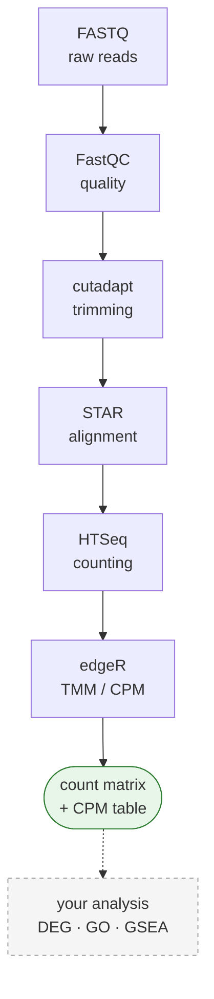

# BulkRNAseq_Pipeline

**Takes raw sequencing files (FASTQ) and produces a gene-level expression table.**

Interpretation steps — differential expression, GO enrichment, and so on — are *not* here.
Everything that comes *before* them is. Preprocessing is the same work in every project, so
rather than rewriting it each time, every project uses this one repository.



The green box is what this pipeline hands you. Everything after it is your analysis.

---

## Contents

1. [Before you start — what each step does](#1-before-you-start--what-each-step-does)
2. [Installation](#2-installation)
3. [Adding your data](#3-adding-your-data)
4. [Writing group.conf](#4-writing-groupconf)
5. [Running stage 1](#5-running-stage-1)
6. [Deciding strandedness — the one call you make yourself](#6-deciding-strandedness--the-one-call-you-make-yourself)
7. [Running stage 2](#7-running-stage-2)
8. [Reading the results](#8-reading-the-results)
9. [Common errors](#9-common-errors)
10. [Design rules](#10-design-rules)
11. [Adding a new kit](#11-adding-a-new-kit)
12. [Self-check](#12-self-check)
13. [Running on SLURM](#13-running-on-slurm)

---

## 1. Before you start — what each step does

If this is your first time, this table is enough. Running the pipeline is two commands; the
table explains what happens inside them.

| Step | Tool | What it does | Why it is needed |
|---|---|---|---|
| Quality check | FastQC | Summarizes read length, quality scores, GC content as plots | To catch a failed sample **before** analysis. Finding out later costs days |
| Adapter removal | cutadapt | Trims the artificial sequence (adapter) stuck to the end of reads | Adapters do not exist in the genome, so leaving them makes alignment fail or land in the wrong place |
| Alignment | STAR | Finds where in the genome each read came from | RNA-seq reads have introns spliced out, so the aligner must allow a read to span two exons (splice-aware) |
| Counting | HTSeq | Counts how many reads fall in each gene | These numbers are the raw material of "expression" |
| Normalization | edgeR (TMM to CPM) | Corrects for differing total read counts between samples | If sample A has 50M reads and B has 20M, raw counts cannot be compared directly |

**Two terms up front:**

- **read** — a short sequence fragment the sequencer read out (typically 50–150 bp). A FASTQ
  file holds tens of millions of them.
- **paired-end** — both ends of the same fragment were read. Files arrive as `_1` and `_2`.
  If only one end was read it is **single-end** and there is a single file. The pipeline detects
  which one you have.

---

## 2. Installation

### 2-0. What you need first

| | |
|---|---|
| **A Linux server with a shell** | Everything here runs from the command line |
| **conda** | Miniconda or Anaconda, installed and on your `PATH`. `setup.sh` builds the tool environment with it but cannot install conda itself — see below |
| **Disk** | Roughly 3–4× your raw FASTQ, plus ~30 GB per STAR index. A 40 GB dataset wants ~200 GB free |
| **Memory** | 32 GB or more. Building a human STAR index needs that much on its own |
| **Time** | Hours, not minutes. A first run on ~18 samples takes most of a day |

If conda is missing, install Miniconda into your home directory — no admin rights needed:

```bash
wget https://repo.anaconda.com/miniconda/Miniconda3-latest-Linux-x86_64.sh
bash Miniconda3-latest-Linux-x86_64.sh      # accept the defaults
exec $SHELL -l                              # reopen the shell so conda is on PATH
conda --version
```

> **A job scheduler is the one thing you may not be able to add yourself.** SLURM is part of
> how a machine is administered, so if your cluster does not already have it, installing it is
> a system administrator's job. You do not need it: `bash` and `nohup` run the pipeline exactly
> the same, and that is the normal way on a single server.
> [Section 13](#13-running-on-slurm) covers the cluster case.

### 2-1. Get the repository

Clone it into your home directory. Reference genomes, intermediates, and results all
accumulate inside this folder, so put it somewhere with room to spare (several TB).

```bash
cd ~
git clone https://github.com/YuHwanYuHwan/BulkRNAseq_Pipeline.git
cd BulkRNAseq_Pipeline
```

```
~/BulkRNAseq_Pipeline/
  rawData/            raw FASTQ (yours, or downloaded)
  reference_Genomes/  genome FASTA, GTF, STAR indexes
  Processed/          intermediates (trimmed FASTQ, BAM) — safe to delete
  Output/             final results (count matrix, CPM, reports)
  Scripts/            the pipeline itself
```

### 2-2. Install the software

All tools go into a single conda environment.

```bash
bash setup.sh --create-env
```

This creates a conda environment named `rnaseq-preproc` containing:

| Tool | Purpose |
|---|---|
| `sra-tools` | Download FASTQ from public databases (NCBI SRA) |
| `pigz` | Parallel gzip - compresses the downloaded FASTQ on all cores |
| `FastQC` | Read quality check |
| `cutadapt` | Adapter removal |
| `STAR` | Genome alignment and index building |
| `HTSeq` | Per-gene counting |
| `MultiQC` | Merges every QC output into one report |
| `R` + `edgeR` | TMM/CPM normalization |

To do it by hand instead:

```bash
conda create -n rnaseq-preproc -c conda-forge -c bioconda \
    sra-tools fastqc cutadapt star htseq multiqc bioconductor-edger pigz
conda activate rnaseq-preproc
```

> Channel order matters. `conda-forge` must come **before** `bioconda` or dependency
> resolution breaks.

### 2-3. Prepare a reference genome

To know where a read belongs you need the **genome sequence (FASTA)** and the **gene
coordinates (GTF)**. These are large (several GB) and the version choice is yours, so you
download them yourself.

Get them from the [Ensembl FTP](https://ftp.ensembl.org/pub/) and place them in
`reference_Genomes/` **inside the repository**, in the layout below. The path is fixed — there
is no setting for it.

```
reference_Genomes/
  Homo_sapiens/
    Homo_sapiens.GRCh38.dna.primary_assembly.fa
    Homo_sapiens.GRCh38.113.gtf
  Mus_musculus/
    Mus_musculus.GRCm39.dna.primary_assembly.fa
    Mus_musculus.GRCm39.115.gtf
```

```bash
# example: human genome, Ensembl release 113
mkdir -p reference_Genomes/Homo_sapiens && cd reference_Genomes/Homo_sapiens
wget https://ftp.ensembl.org/pub/release-113/fasta/homo_sapiens/dna/Homo_sapiens.GRCh38.dna.primary_assembly.fa.gz
wget https://ftp.ensembl.org/pub/release-113/gtf/homo_sapiens/Homo_sapiens.GRCh38.113.gtf.gz
gunzip *.gz
cd ../..
```

> **Name the folder with the scientific name** (`Homo_sapiens`, `Mus_musculus`). The scripts
> locate files by that name.

**Do not download a STAR index.** An index is the genome pre-processed into a structure STAR
can search quickly, and it has to match the read length of your data — so the pipeline
**builds it when it is needed**. Once built it is kept forever and reused by later datasets.
(About 30 GB of disk per index; building one needs 32 GB or more of RAM.)

### 2-4. Verify the installation

```bash
bash setup.sh
```

Without `--create-env` this **installs nothing and only reports status**. It is safe to run as
often as you like.

```
== config ==
  [ OK ] config.sh
== tools ==
  [ OK ] prefetch
  [ OK ] STAR
  ...
== reference genomes ==
  [ OK ] Homo_sapiens  (Homo_sapiens.GRCh38.113.gtf)
== disk ==
  [ OK ] 75826G free
== self-check ==
  [ OK ] logic 6/6

Ready. Next: put FASTQ under rawData/<project>/<group>/ and write group.conf (species).
```

Fix every `[MISS]` before going further. The point of this script is to keep you from
**discovering at hour six of a STAR run that the reference genome was never there.**

`[ OK ] logic 6/6` is the pipeline checking its own logic. It runs with no bioinformatics tool
installed at all, so you can confirm the code is sound right after cloning.

<details>
<summary>When tools are not on PATH (config.sh)</summary>

`setup.sh` writes `config.sh` for you. Only `CONDA_ENV` is filled in; uncomment the rest as
needed.

```bash
# conda environment holding the tools. Every script activates it automatically
CONDA_ENV="rnaseq-preproc"

# cores for STAR, index building, trimming, and download compression.
# a SLURM reservation always wins over this
THREADS=8

# only if you use a manually downloaded FastQC instead of the conda one
FASTQC_BIN="/home/user/FastQC/fastqc"
```

The order is: a SLURM reservation first, then `THREADS`, then `nproc`. Inside a job the
reservation always wins — reserving 32 cores and then running on 8 wastes the other 24, so if
you want fewer, reserve fewer. `THREADS` is for the case outside a job: on a shared head node,
`nproc` would hand one run every core on the machine, and a second run would then compete with
the first for them.

If your tools are already installed some other way, set `CONDA_ENV=""`.

`config.sh` differs per machine, so it is not tracked by git (`.gitignore`).
</details>

---

## 3. Adding your data

### The folder layout

```
rawData/<project>/<group>/
```

- **project** — the research unit. For example `ProjectA`
- **group** — **the unit that produces one count matrix.** For example `Treated_vs_Control`

You split into groups by asking "will these samples be compared to each other?" Controls and
treated samples belong in the same group; an unrelated experiment gets its own group.
**Normalization happens per group**, so mixing unrelated samples distorts it.

### Option A. Public data (GEO/SRA)

All you need are run accessions.

```bash
bash Scripts/PublicData_download.sh rawData/ProjectA/GroupA SRR0000001 SRR0000002
```

If there are many, pass a file instead.

```bash
bash Scripts/PublicData_download.sh rawData/ProjectA/GroupA srr_list.txt
```

The script downloads the FASTQ files, compresses them, and **groups runs into a subfolder when
several belong to one sample.**

That last part matters. A single GEO sample (GSM) is often split into several SRA runs (SRR).
Treating each run as its own sample **inflates your sample count and halves the apparent
expression.** To get this right the script fetches SRA runinfo into `.runinfo.csv` and reads
the `SampleName` column; later steps then merge those runs automatically. That file is
machinery, not your metadata — ignore it.

**It does not download a sample sheet, and that is deliberate.** The conditions you actually
need — tissue, treatment, donor, cell type — are not in runinfo at all. When the download
finishes the script prints a Run Selector link for the study and asks you to save the metadata
sheet yourself:

```
rawData/<project>/<group>/SraRunTable.csv
```

Nothing in the pipeline reads that file. You read it, to know which count-matrix column is
which condition. Checking that the dataset is genuinely bulk RNA-seq — not single-cell, not
3'-tag — is part of the same look, and it is on you: the pipeline will happily process 10x
reads and hand you meaningless numbers.

### Option B. Your own data

Just drop the FASTQ files into the group folder. **The filename is the sample name.**

```
rawData/ProjectA/GroupA/
    Control_1_1.fastq.gz       <- sample: Control_1 (paired-end)
    Control_1_2.fastq.gz
    Treated_1_1.fastq.gz       <- sample: Treated_1
    Treated_1_2.fastq.gz
    Treated_2.fastq.gz         <- sample: Treated_2 (single-end)
    Control_2/                 <- folder name is the sample name; runs inside are merged
        run_A_1.fastq.gz
        run_A_2.fastq.gz
        run_B_1.fastq.gz
        run_B_2.fastq.gz
```

There are only three rules.

| Layout | Interpretation |
|---|---|
| Flat files `X_1.fastq.gz` + `X_2.fastq.gz` | Sample `X`, paired-end |
| Flat file `X.fastq.gz` | Sample `X`, single-end |
| Folder `X/` | Sample `X`, every run inside is merged |

**There is no sample sheet.** The directory structure is the single source of truth. A separate
sheet silently produces wrong results the moment it disagrees with the files on disk.

To check what the pipeline sees:

```bash
bash Scripts/list_samples.sh rawData/ProjectA/GroupA
```

Output is `sample <TAB> R1 <TAB> R2`. What you see there is exactly what will be processed — a
sample missing from this list stays missing, so it is worth a look before starting a job that
runs for hours.

---

## 4. Writing group.conf

**This is the only file you write by hand.** It goes inside the group folder.

```bash
cat > rawData/ProjectA/GroupA/group.conf <<'CONF'
species      = Homo_sapiens
adapter_kit  = Illumina_TruSeq
strandedness =
CONF
```

| Field | Required | Description |
|---|---|---|
| `species` | yes | Must match a folder name under `reference_Genomes/` exactly |
| `adapter_kit` | no | Library prep kit. Defaults to `Illumina_universal`. See `Scripts/AdapterSequenceList.csv` |
| `strandedness` | later | **Leave it empty at first.** You fill it in after stage 1 (section 6) |

Spaces around `=`, quotes, and `#` comments are all accepted.

<details>
<summary>Why is read length or paired/single not in here?</summary>

The rule is: **anything derivable from the data is never asked of a human.** Read length comes
from the FASTQ; layout comes from the file count. Every field a person types is another chance
for a typo to corrupt the result.

`strandedness` is the opposite case — it **cannot be known without counting the data**, so a
person supplies it.
</details>

---

## 5. Running stage 1

```bash
bash Scripts/run_stage1.sh rawData/ProjectA/GroupA
```

This runs FastQC, cutadapt, STAR, and the strandedness probe, in order.

**It takes a long time.** Depending on sample count and sequencing depth, STAR alone is roughly
20 minutes to an hour per sample, and the first run adds index building (1–2 hours) in front of
that. To keep it running after you disconnect:

```bash
nohup bash Scripts/run_stage1.sh rawData/ProjectA/GroupA > logs/stage1.log 2>&1 &
tail -f logs/stage1.log      # Ctrl+C stops watching, not the job
```

To stop a background run later, kill the whole process group — killing the wrapper alone
leaves `STAR` or `cutadapt` running as orphans:

```bash
kill -- -$(ps -o pgid= <PID> | tr -d ' ')
```

On a cluster you would submit this as a job instead — see [section 13](#13-running-on-slurm).

Every step stamps its start and end, so the log reads as a timeline and a slow step is obvious
without timing anything yourself:

```
[2026-08-20 11:02:14] ==> FastQC
[FQC ] Control_1
...
[2026-08-20 11:41:07] <== FastQC  00:38:53
[2026-08-20 11:41:07] ==> Trimming
```

A failed step is stamped too, with its exit code.

### What a healthy run looks like

```
[2026-08-20 11:02:14] ==> FastQC
[FQC ] Control_1
[FQC ] Control_2
...
[DONE] FastQC 18 samples -> .../Processed/ProjectA/GroupA/Fastqc_result
[2026-08-20 11:41:07] <== FastQC  00:38:53

[2026-08-20 11:41:07] ==> Trimming
[KIT ] Illumina_universal  R1=AGATCGGAAGAGCACACGTCT  R2=AGATCGGAAGAGCGTCGTGTA
[TRIM] Control_1
...
[DONE] cutadapt 18 samples -> .../AdapterTrimming_result
[2026-08-20 13:20:41] <== Trimming  01:39:34

[2026-08-20 13:20:41] ==> Alignment
[LEN ] max trimmed read = 150bp -> sjdbOverhang=149
[IDX ] reuse .../reference_Genomes/Homo_sapiens/index/overhang149
[STAR] Control_1
...
[DONE] STAR 18 samples -> .../Alignment_result
       next: probe_strandedness.sh .../rawData/ProjectA/GroupA
[2026-08-20 19:55:02] <== Alignment  06:34:21

[2026-08-20 19:55:02] ==> probe_strandedness
[PROBE] sample=Control_1  -s reverse
...
```

Four things say it is going right:

| Line | What to check |
|---|---|
| `[DONE] FastQC 18 samples` | the count matches the samples you expect — this is the first place a missing file shows up |
| `[KIT ] ... R1=AGATCGG...` | an adapter was found for your kit. `R2=(none)` is correct for single-end |
| `[LEN ] ... sjdbOverhang=149` | derived from your trimmed reads. 150 bp reads give 149 |
| `[IDX ] reuse ...` | an existing index fits. `[IDX ] building ...` instead means a new one is being made — correct, but adds 1–2 hours |

`[SKIP] Control_1` appears when you re-run after an interruption — the `.done` marker doing its
job, not an error. A resumed run reports the group's full size with a note, so the count stays
comparable:

```
[SKIP] Control_1
...
[DONE] FastQC 18 samples -> .../Fastqc_result  (18 already done)
```

> **It is fine if it dies partway.** Finished samples leave a `.done` marker, so re-running
> prints `[SKIP]` for them and resumes where it stopped. Just issue the same command again.

<details>
<summary>Running the steps one at a time</summary>

Every script takes **one group folder** and nothing else.

```bash
bash Scripts/FastQC.sh             rawData/ProjectA/GroupA
bash Scripts/Trimming.sh           rawData/ProjectA/GroupA
bash Scripts/Alignment.sh          rawData/ProjectA/GroupA
bash Scripts/probe_strandedness.sh rawData/ProjectA/GroupA
```
</details>

---

## 6. Deciding strandedness — the one call you make yourself

### What is being decided

Depending on how the library was prepared, the data may or may not preserve **which strand of
the original RNA a read came from**. That is `strandedness`.

| Value | Meaning |
|---|---|
| `no` | No strand information (unstranded). Reads on either strand are counted |
| `reverse` | Strand-aware; reads run **opposite** to the gene (most modern kits) |
| `yes` | Strand-aware; reads run in the **same** direction as the gene |

**Getting this wrong raises no error.** Reads are silently dropped instead of being assigned to
genes, and you end up with a table whose expression values are uniformly deflated. That is why
it gets checked before proceeding.

### Why it is not decided automatically

Because the kit name does not predict it. Datasets exist that carry the name
`SureSelect Strand Specific` and are nonetheless unstranded. Trusting the name means being
wrong without noticing.

### How to decide

The last step of stage 1, `probe_strandedness.sh`, counts **a single sample** with
`-s reverse` and shows you the outcome.

```
[PROBE] sample=Control_1  -s reverse

  total reads counted : 18036903
  assigned to genes   : 8983930 (49.8%)
  __no_feature        : 7858202 (43.6%)
  __ambiguous         : 562437

  --> likely strandedness : no        (about half assigned -> unstranded)
```

That is a real run, and a good example of why the kit name is not the answer: the library was
a poly-A prep from a vendor whose standard kit is directional, yet only half the reads land on
the sense strand. The data says unstranded, so unstranded it is.

`__no_feature` is the **fraction of reads that could not be assigned to any gene**. One reverse
run separates all three cases:

| `__no_feature` under `-s reverse` | Conclusion | Why |
|---|---|---|
| Low (~10–20%) | **`reverse`** | Reads were assigned; the assumption held |
| Middle (~50%) | **`no`** | Half the reads sit on the other strand — no strand information |
| High (80%+) | **`yes`** | Almost nothing was assigned — the direction was assumed backwards |

The probe ends by printing the exact command to record your answer, with its own reading
filled in — paste it, or edit the value first if you read the numbers differently:

```
      sed -i 's/^strandedness.*/strandedness = no/' rawData/ProjectA/GroupA/group.conf
```

> These thresholds are heuristics. If you land somewhere ambiguous, say 35%, probe another
> sample. **The judgment is yours** — the pipeline offers a reading and writes nothing.

---

## 7. Running stage 2

```bash
bash Scripts/run_stage2.sh rawData/ProjectA/GroupA
```

HTSeq, count matrix, CPM, then MultiQC and the report.

If `strandedness` is still empty the run **refuses to start**, which beats burning hours on a
wrong value.

```
[ERROR] group.conf strandedness must be no|yes|reverse (got 'empty')
        run: bash Scripts/probe_strandedness.sh rawData/ProjectA/GroupA
```

### What a healthy run looks like

```
[2026-08-20 21:03:11] ==> ReadCount
[HTSEQ] strandedness=reverse  gtf=Homo_sapiens.GRCh38.113.gtf
[CNT ] Control_1
...
[DONE] HTSeq 18 samples
       matrix: .../Output/ProjectA/GroupA/GroupA_count_matrix.tsv  (62703 genes x 18 samples)
[2026-08-20 22:15:40] <== ReadCount  01:12:29

[2026-08-20 22:15:40] ==> CalcCPM
[CPM ] 62703 genes x 18 samples -> .../GroupA_CPM.tsv
[2026-08-20 22:15:52] <== CalcCPM  00:00:12

[2026-08-20 22:15:52] ==> MultiQC
[DONE] .../Output/ProjectA/GroupA/GroupA_pipeline_report.txt
[2026-08-20 22:16:30] <== MultiQC  00:00:38
```

No `[WARN]` line is the point here. `[WARN] Control_1: __no_feature 68.3%` means the
strandedness is wrong — fix `group.conf`, delete the `.done` markers under
`Processed/.../HTseqCount_result/`, and run stage 2 again.

The gene count depends on the annotation, not on your data: every sample in a group is counted
against the same GTF, so the matrix has the same number of rows whatever you sequenced.

---

## 8. Reading the results

```
Output/<project>/<group>/
    <group>_count_matrix.tsv      raw counts, genes x samples
    <group>_CPM.tsv               TMM-normalized CPM
    <group>_multiqc_report.html   QC summary for every step (open in a browser)
    <group>_pipeline_report.txt   versions, parameters, QC, and a Methods draft
```

**`count_matrix.tsv`** is the input to whatever comes next, such as differential expression.

```
Gene              Control_1  Control_2  Treated_1  Treated_2
ENSG00000000003        1284       1301        997       1043
ENSG00000000005           0          0          0          0
```

From here the count matrix goes into whatever you use for differential expression — DESeq2 or
edgeR in R are the usual choices, both of which take **raw counts**, not the CPM table. The CPM
file is for plotting and clustering, where library size has to be out of the way. That analysis
is deliberately not part of this repository: preprocessing is identical everywhere, while the
comparison you run is specific to your question.

**`pipeline_report.txt`** exists for the day you write the paper. It records the tool versions,
parameters, and genome release, and includes a draft Methods paragraph — so that a year later
you are not hunting for which STAR version you used.

<details>
<summary>What to look at in the MultiQC report</summary>

- **FastQC, Per base sequence quality**: a sharp drop at the 3' end may call for more trimming
- **cutadapt, Filtered Reads**: losing an unusual fraction suggests the wrong kit was specified
- **STAR, Alignment Scores**: uniquely mapped below ~70% is a reason to double-check the species
</details>

### `Processed/` can be deleted

```
Processed/<project>/<group>/
    Fastqc_result/  AdapterTrimming_result/  Alignment_result/  HTseqCount_result/
```

These are trimmed FASTQ and BAM files, so they are large: one to two times the raw data.
They are **regenerated from the raw data and these scripts at any time**, so they are not
backup material — delete them when disk runs short.

---

## 9. Common errors

| Message | Cause | Fix |
|---|---|---|
| `not under rawData/` | The group folder is not below `rawData/` | Use the form `rawData/<project>/<group>` |
| `group.conf must define species` | `species` missing or misspelled | Match the `reference_Genomes/` folder name, including case |
| `kit 'XXX' not in AdapterSequenceList.csv` | Unknown kit name | Add a row (section 11), or leave `adapter_kit` empty |
| `strandedness must be no\|yes\|reverse` | Value never filled in after stage 1 | See section 6 |
| `run Trimming.sh first` | A step was skipped | Run the steps in order |
| `produced no valid BAM` | STAR died, usually out of memory | Check the log. Index building needs 32 GB or more of RAM |
| `[WARN] __no_feature 68.3%` | Wrong strandedness | Correct the value, delete `Processed/*/HTseqCount_result/.*.done`, re-run |

**To force a re-run**, delete the `.done` markers of that step.

```bash
rm -f Processed/ProjectA/GroupA/HTseqCount_result/.*.done   # redo HTSeq only
rm -rf Processed/ProjectA/GroupA                            # redo everything
```

---

## 10. Design rules

Why the pipeline looks the way it does. Read this before changing anything.

- **The directory is the source of truth for sample identity.** There is no sample sheet. The
  moment a sheet disagrees with the files on disk you get quietly wrong results, and nobody
  notices.

- **Derivable values are never asked for; underivable ones stop the run.** Read length, layout,
  and species come from the data. Strandedness gets no silent default — an empty value is
  refused.

- **`sjdbOverhang` is computed from the data**: maximum read length after trimming, minus one.
  It is the length of sequence STAR places on each side of a splice junction when aligning
  reads that cross one, and **every sample in a group must use the same value** — otherwise the
  counts are not comparable.

- **A STAR index is kept forever once built.** The next dataset needing the same overhang
  reuses it; the version it was built against is recorded in each group's pipeline report.

- **Samples run serially.** Parallelizing them across SLURM array tasks measured slower: STAR
  saturates I/O and memory bandwidth before CPU, so giving one sample all the cores wins.

- **`.done` resumes, but output validity is checked too.** A dead node can leave a 0-byte BAM
  behind, and trusting the marker alone would let it pass as complete.

- **Preprocessing happens in this repository only.** Do not copy it per project. Research
  projects consume `Output/<project>/<group>/` and nothing else.

---

## 11. Adding a new kit

When you meet an unknown kit, add one row to `Scripts/AdapterSequenceList.csv`. Every later
dataset reuses it.

```csv
kit,adapter_R1,adapter_R2
MyNewKit,AGATCGGAAGAGCACACGTCT,AGATCGGAAGAGCGTCGTGTA
```

You can find the adapter sequence in the kit manual or in the FastQC *Adapter Content* plot.
`adapter_R2` is used only for paired-end data and ignored otherwise.

**Strandedness does not belong in this file** — the kit name does not predict it (section 6).

---

## 12. Self-check

```bash
bash setup.sh                    # full environment, self-check included
bash Scripts/lib/selfcheck.sh    # logic only
```

This exercises sample scanning, merge grouping, `group.conf` parsing, overhang computation,
matrix assembly, and probe interpretation. **It runs with no bioinformatics tool installed**,
so you can verify the code right after cloning, and use it as a regression check after editing
a script.

---

## 13. Running on SLURM

The stage wrappers are valid batch scripts as they are — the `#SBATCH` directives sit inside
them, so `sbatch` needs no extra arguments.

```bash
cd ~/BulkRNAseq_Pipeline          # submit from the repository root
sbatch Scripts/run_stage1.sh rawData/ProjectA/GroupA
squeue -u $USER
```

> Submit from the repository root. The log path in the directives is relative
> (`logs/stage1_%j.out`), so submitting from elsewhere leaves the job nowhere to write and it
> fails before running anything.

What each stage reserves:

| Stage | Cores | Memory | Why |
|---|---|---|---|
| 1 | 32 | 96 GB | STAR alignment, and building an index if one is missing (that alone wants 32 GB+) |
| 2 | 12 | 48 GB | one `htseq-count` per core, each holding its own copy of the annotation |

Override per submission when a dataset is unusually large or the queue is busy; the command
line beats the directives in the file:

```bash
sbatch --cpus-per-task=16 --mem=48G Scripts/run_stage1.sh rawData/ProjectA/GroupA
```

Stage 2 scales almost linearly: `htseq-count` is single-threaded and CPU-bound, measured at
~23,000 read pairs per second whether one or four run side by side. Reserving more cores counts
more samples at once.

**You do not also have to set `THREADS`.** The scripts read `SLURM_CPUS_PER_TASK`, so the
tools use exactly what the job reserved — reserve less and they scale down with it.

Logs land in `logs/stage1_<jobid>.out` and `logs/stage2_<jobid>.out`, timestamps included, so
`tail -f` shows which step is running and what the previous one cost.

```bash
tail -f logs/stage1_*.out
scancel <jobid>                   # SLURM kills the whole job, orphans and all
```

**The two stages are deliberately not chained** with `--dependency`. Stage 1 ends at the
strandedness probe, and that answer is yours to give (section 6); an automatic hand-off would
run stage 2 before anyone read the result. Within a stage nothing needs chaining either — each
wrapper is a single job running its steps in order, and `set -e` stops it at the first failure.
